[README.md](https://github.com/user-attachments/files/27379065/README.md)
# Real-World Applications of Statistics
### Six Stories That Show What This Course Is Really For

---

> *You have spent a semester learning tools. Today we connect those tools to the world you already live in.*

---

## Table of Contents

| # | Topic | The Big Idea |
|---|-------|-------------|
| 1 | [The Observer Effect](#1-the-observer-effect) | Your expectations change what you measure |
| 2 | [Do Storks Deliver Babies?](#2-do-storks-deliver-babies) | Correlation does not mean causation |
| 3 | [Okun's Law](#3-okuns-law) | Real correlation in the news every week |
| 4 | [The Shape of Income](#4-the-shape-of-income) | Why mean and median tell different stories |
| 5 | [Survivorship Bias](#5-survivorship-bias) | The data you cannot see is often the most important |
| 6 | [The Birthday Problem](#6-the-birthday-problem) | Why our gut instinct about probability is usually wrong |

---

## Opening

Think about what you have covered this semester: averages, distributions, correlation, probability. These are not just things you learn for a test. They are ways of seeing.

Every example today comes from the real world -- history, economics, investing, everyday news. Some of these will surprise you. A few will change how you think about things you encounter all the time.

---

## 1. The Observer Effect

> **The big idea:** When someone knows what result they expect, they can unconsciously influence what they measure -- and what the subject does. Good experiments are designed to prevent this.

### The Story of Clever Hans

In the early 1900s, a horse named Hans became famous across Europe. His trainer, Wilhelm von Osten, was a sincere and well-respected mathematics teacher who genuinely believed he had taught the horse to do arithmetic.

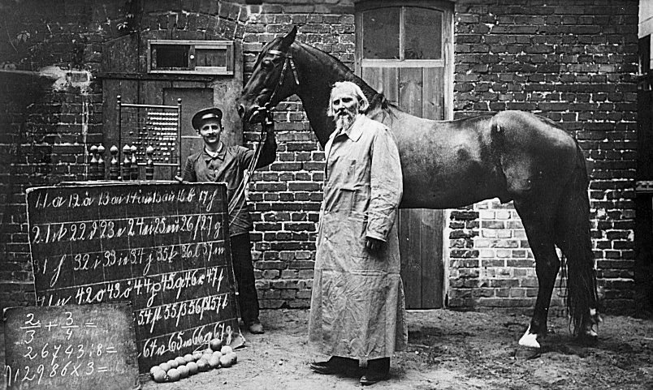
*Wilhelm von Osten with Clever Hans, Berlin, 1907. The chalkboard shows arithmetic problems Hans was said to solve by tapping his hoof.*

Hans was tested publicly by scientists, journalists, and educators. He appeared to answer math questions, spell words, and identify musical notes -- all by tapping his hoof the correct number of times. Committees investigated and found no evidence of trickery. Von Osten was not a fraud. He was fooled along with everyone else.

Psychologist Oskar Pfungst cracked it with one simple test: **he varied whether the questioner knew the answer.**

When the questioner did not know the answer, Hans could not answer either. When the questioner knew -- even while trying hard not to give anything away -- Hans performed well.

Hans was reading the questioner's body language. A barely visible forward lean. A slight change in breathing. A tiny dip of the head that happened the instant the questioner reached the expected answer. Hans had learned to stop tapping at exactly that moment. He was not doing math. He was reading people.

**What went wrong statistically:** The experiment had no way to separate Hans's performance from the questioner's behavior. The two were tangled together. This is called **observer bias** -- the observer's expectations leaked into the measurement.

The fix is something you have heard of: a **blind experiment.** The questioner does not know the answer, so they cannot signal it. When Pfungst ran the blind version, Hans's performance collapsed to chance.

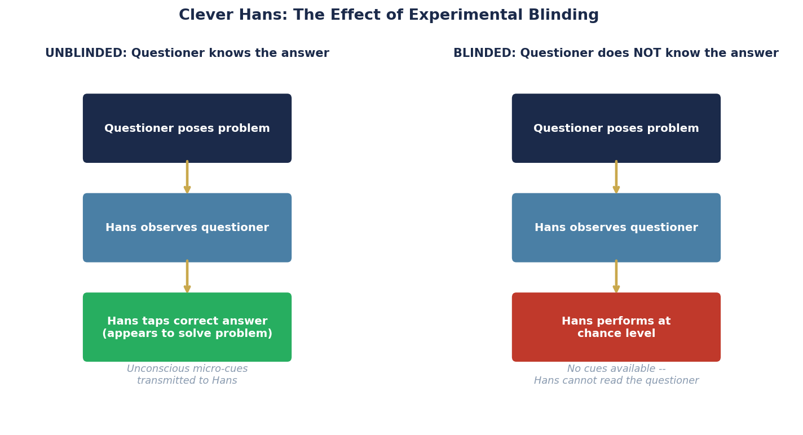
*Left: without blinding, Hans reads the questioner's unconscious cues. Right: with blinding, the signal disappears and Hans performs no better than random.*

---

### Poker: The Same Problem, Solved Differently

Championship poker players have independently figured out the same thing Von Osten missed. The game is not just about your cards -- it is about controlling what information leaks from you to the people watching you.

*A championship poker player at the World Series of Poker. The mirrored sunglasses, hood, and hat brim are not fashion choices -- they are countermeasures against the observer effect.*

Professional players use:
- **Mirrored sunglasses** to hide eye movement and pupil dilation
- **Consistent timing** on every decision so the speed of a bet reveals nothing about hand strength
- **Deliberate false tells** -- planting observable behaviors that mean the opposite of what an opponent expects

The goal is exactly what Pfungst achieved in his experiment: make the observable signal carry zero information about the underlying truth.

---

### Artificial Intelligence: The Most Impressionable Subject of All

AI models learn entirely from the data they are trained on. If that data carries human biases and expectations, the model absorbs them completely.

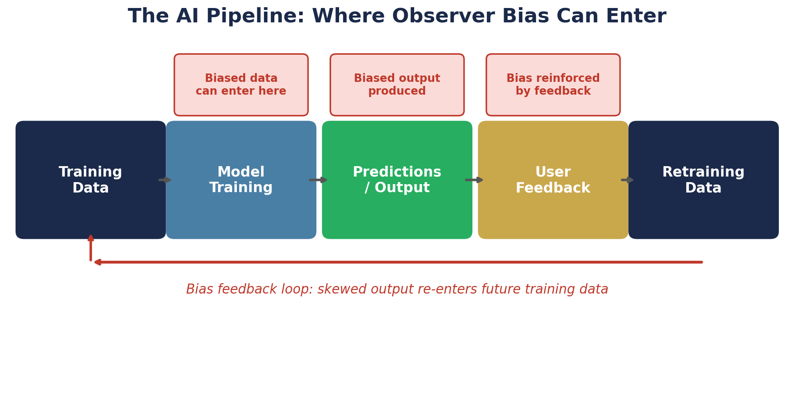
*The AI training pipeline. Bias can enter at the data stage, get amplified through the model, and then loop back into future training data through user feedback -- compounding with each cycle.*

Consider what happens when:
- The people who labeled the training data had systematic blind spots
- The model's outputs influence what content gets shown to users
- That user behavior then feeds back into the next round of training

Each cycle can reinforce the original bias. Hans learned to read one questioner. An AI trained on biased data can learn to reflect those biases back to millions of people, at scale, continuously.

The countermeasures are the same in principle: diverse data, independent auditing, and ongoing testing on data the model has never seen.

> **Think about it:** When an AI confidently gives you a wrong answer, what does the Clever Hans story suggest about where that confidence came from?

**Sources:**
- Pfungst, O. (1911). *Clever Hans.* Holt.
- Rosenthal, R., & Jacobson, L. (1968). Pygmalion in the classroom. *Urban Review, 3*(1), 16-20.

---

## 2. Do Storks Deliver Babies?

> **The big idea:** Two things can be strongly correlated -- even with a statistically significant result -- and have absolutely no causal connection. A hidden third variable can explain the whole thing.

### A Real Study With a Real Result

In 2000, statistician Robert Matthews published a paper in the journal *Teaching Statistics.* He looked at data from 17 European countries and measured the correlation between the number of breeding stork pairs and the human birth rate.

**The result: r = 0.62, statistically significant.**

That is a moderately strong positive correlation. By the numbers alone, this looks like a real relationship.

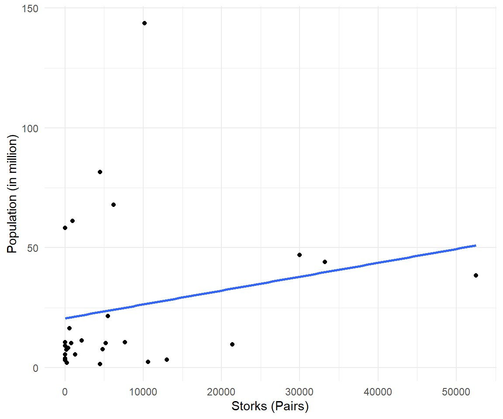
*Stork breeding pairs vs. population across 17 European countries. The upward trend is real in the data. The explanation has nothing to do with storks.*

More storks, more babies. The data says so.

Except storks do not deliver babies. So what is going on?

---

### The Hidden Third Variable

Both stork populations and birth rates are being driven by something else entirely: **country size.**

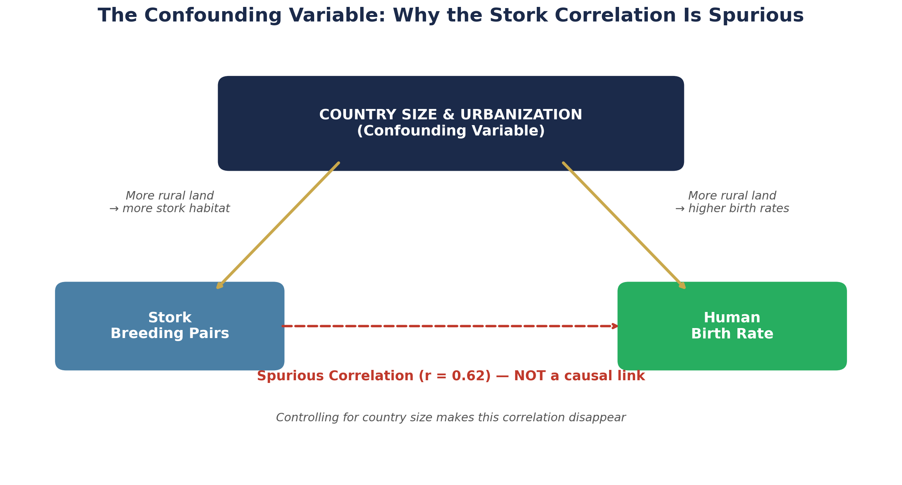
*Country size drives both variables independently. The apparent link between storks and births disappears once you account for it.*

Larger, more rural countries -- Turkey, Poland, Romania -- have vast territories with plenty of stork habitat and also higher birth rates. Smaller, more urbanized countries -- Denmark, the Netherlands, Switzerland -- have little stork habitat and lower birth rates.

The storks and the babies are both responding to the same underlying factor. Neither is causing the other.

In statistics we call this a **confounding variable** -- a third factor that produces an apparent relationship between two things that have no real connection.

---

### How to Spot This in the Wild

The test is simple: ask yourself, *is there a third thing that could plausibly be causing both of these?*

Some examples:
- Ice cream sales and drowning deaths both rise in summer -- both are caused by hot weather, not each other
- Students who eat breakfast get better grades -- but family income and home stability may explain both the breakfast and the grades
- People who go to the doctor more often live longer -- but people with more access to healthcare are also wealthier on average

**The gold standard fix** is to randomly assign people to groups. When assignment is truly random, the confounding variable gets distributed equally across both groups and cannot produce a spurious result. This is why randomized controlled trials are the highest standard in medical research.

> **Think about it:** A news story reports that people who drink red wine live longer. Before you accept this, what confounding variable should you ask about?

**Sources:**
- Matthews, R. (2000). Storks deliver babies (p = 0.008). *Teaching Statistics, 22*(2), 36-38.
- Vigen, T. *Spurious Correlations.* https://www.spuriouscorrelations.com

---

## 3. Okun's Law

> **The big idea:** Some correlations in the real world are strong, well-documented, and practically useful -- even when they are not perfect. Learning to read a scatter plot tells you as much as the number itself.

### Unemployment and the Economy

You have heard about GDP and unemployment your entire life on the news. What you may not know is that there is a well-documented statistical relationship between them.

Arthur Okun observed in 1962 that when the economy grows, companies hire people and unemployment falls. When the economy shrinks, companies cut workers and unemployment rises. He put a rough number on it:

**For every 1% increase in economic growth, unemployment tends to fall by about half a percentage point -- and vice versa.**

The correlation runs between roughly -0.5 and -0.9 depending on the time period. That is a moderate to strong negative relationship.

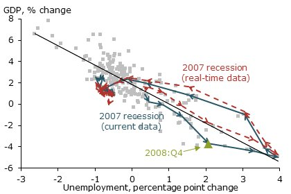
*The Okun's Law scatter plot from the Federal Reserve Bank of San Francisco. Each point is one quarter of U.S. economic data. The downward slope -- more growth, less unemployment -- is consistent across decades. The arrows trace what happened during the 2007-2009 recession as it was unfolding versus how it looks in hindsight.*

**Reading this chart:**
- Each dot is one quarter of data
- The downward slope confirms the negative correlation
- The scatter around the line shows the relationship is real but not mechanical -- other factors matter too
- Notice how the recession path traced a loop, not a straight line -- the relationship shifts under stress

---

### The Lag: Why It Is Messier Than It Looks

The correlation is genuine, but it does not happen instantly.

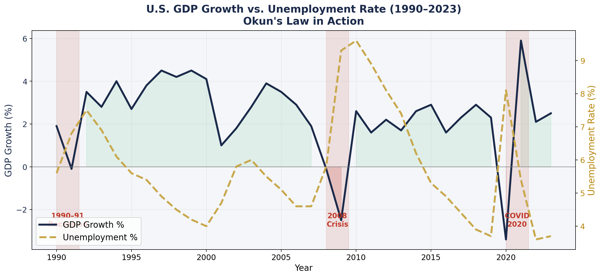
*U.S. GDP growth (navy) and unemployment rate (gold, dashed) 1990-2023. When GDP falls into the red zone, unemployment rises -- but notice the delay. Unemployment peaks after GDP has already started recovering.*

When a recession hits, companies do not immediately lay off everyone. They first reduce hours, freeze hiring, cut contractors, and only then cut permanent staff. When recovery begins, they wait for confirmation before committing to new payroll. This takes months.

The result: unemployment tends to keep rising even after the economy has turned the corner. This is why people often feel like things are still getting worse even when economists say a recession is technically over. Economically they may be right. The job market, which is what most people actually feel, takes longer to catch up.

**Sources:**
- Okun, A. M. (1962). Potential GNP: Its measurement and significance. *Cowles Foundation Paper 190.*
- Federal Reserve Bank of San Francisco. (2014). Okun's Law: Recession and the Jobs Gap. https://www.frbsf.org/research-and-insights/publications/economic-letter/2014/04/okun-law-deviation-unemployment-recession/

---

## 4. The Shape of Income

> **The big idea:** The shape of a distribution determines which summary statistics are honest. In a right-skewed distribution like income, the mean and the median tell very different stories -- and people in power know which one to reach for.

### Two Shapes, Two Different Worlds

You learned two distribution shapes this semester. They look completely different, and that difference matters.

**Height** follows a bell curve -- symmetric, with most people near the middle and equal tails on both sides.

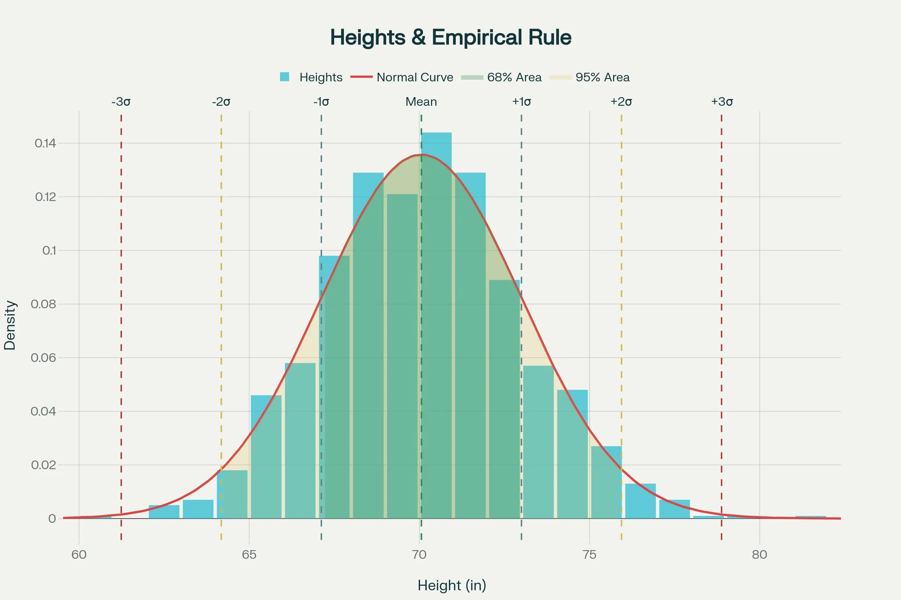
*Adult male height in the U.S. The bell shape is nearly symmetric. The mean, median, and mode all land at essentially the same value -- about 70 inches. The 68-95-99.7 rule applies cleanly.*

With a symmetric distribution, the mean is a fair summary. It sits right in the middle and represents what a typical person looks like.

**Income** is completely different.

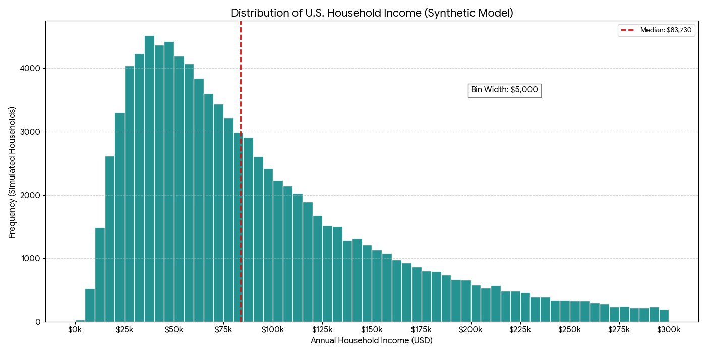
*U.S. household income. The bulk of households earn between $25k and $100k, but the tail extends far to the right. The median (red dashed line) sits at about $83,730 -- well below where the mean lands.*

The income distribution has a long right tail. A small number of households earning millions per year pull the mean far above what most households actually bring home.

---

### Why This Matters

Here is a concrete example. Imagine a company with 9 workers earning $40,000 a year and one CEO earning $1,000,000.

| Measure | Value |
|---------|-------|
| Mean (average) salary | **$136,000** |
| Median salary | **$40,000** |

The mean is not mathematically wrong. But if you want to describe what a typical worker earns, the median is far more honest.

**In a right-skewed distribution, the mean is always pulled toward the tail -- and always overstates what a typical member of the group experiences.**

The median, by definition, is the middle value. Half of all households earn above it, half below. No extreme value can move it much.

When you hear income statistics in the news, the first question to ask is: **mean or median?**

A right-skewed distribution always follows this order from left to right:

**Most common value -- Median -- Mean**

If the mean is higher than the median, the distribution is right-skewed. You now have a diagnostic you can apply every time you see income, wealth, home price, or salary data.

**Sources:**
- U.S. Census Bureau. (2025). *Income in the United States: 2024.* Report P60-286. https://www.census.gov/library/publications/2025/demo/p60-286.html
- Federal Reserve Economic Data (FRED). https://fred.stlouisfed.org/

---

## 5. Survivorship Bias

> **The big idea:** We systematically observe only the cases that survived, succeeded, or made it through some filter. The missing cases are often where the real lesson lives.

### Abraham Wald and the WWII Bombers

During World War II, American bombers were being shot down at an unsustainable rate. The military examined the planes that returned from missions and mapped where bullet holes were concentrated -- mostly in the wings, fuselage, and tail. The obvious proposal: add armor to those areas.

Mathematician Abraham Wald pointed out this was exactly backwards.

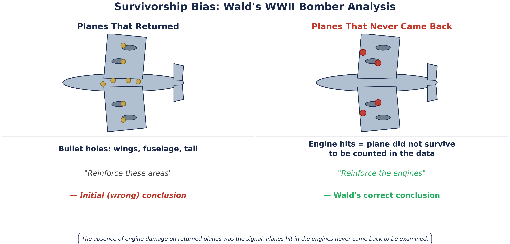
*The planes that returned showed heavy damage to wings and fuselage. But Wald realized the planes that never came back had been hit somewhere else -- in the engines. The absence of engine damage on returned planes was itself the key finding.*

**Wald's insight:** The planes they were studying were the ones that survived. Bullet holes in the wings and fuselage were common on returned planes for exactly one reason -- those hits did not bring the plane down. The planes that took engine hits never made it back. They were not in the dataset at all.

The armor should go on the engines -- the place with the fewest holes on the returned planes -- because that is where hits were fatal.

**The absence of data was the data.**

---

### The Same Bias in Investing

The mutual fund industry is a clean modern version of the same problem.

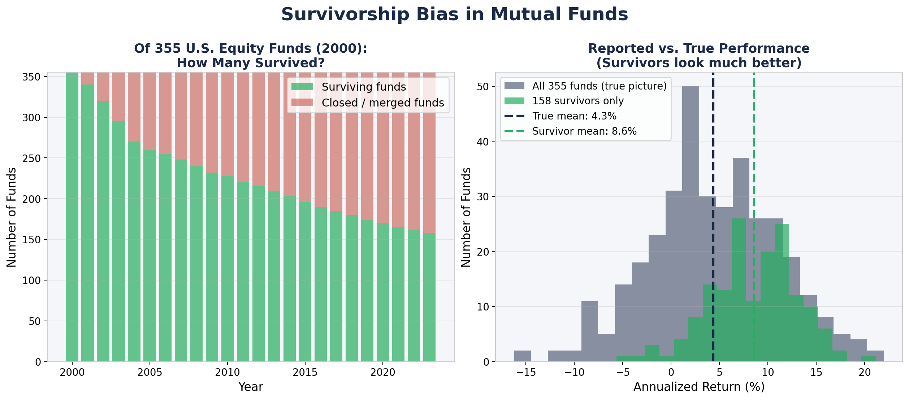
*Left: of 355 equity funds that existed in 2000, fewer than half survived to 2023. The rest were quietly closed or merged when performance was too poor to continue. Right: the surviving funds show much higher average returns than the full original group -- the poor performers have been erased from the advertised history.*

When a fund company says their funds have averaged 8% annual returns over 20 years, they are reporting returns from funds that still exist. Funds that lost money year after year were quietly closed or merged into other funds. Their records vanished.

Studies have found this survivorship bias inflates reported mutual fund performance by roughly 1 to 3 percentage points per year -- which compounds into a dramatically misleading picture over time.

---

### Once You See It, You See It Everywhere

- **"Old buildings were built better"** -- you are only seeing the ones that did not fall down
- **"College dropouts become billionaires"** -- you hear about the handful who succeeded; the far larger number who did not are silent
- **Testimonials for any product** -- people who had good results are far more likely to speak up than people for whom it did not work
- **Published science** -- studies with significant results are far more likely to be published than studies that found nothing; the journals are full of survivors

**The question to always ask:** What would I need to know about the cases I cannot see in order to draw a valid conclusion?

> **Think about it:** A business school publishes the average starting salary of its graduates. What group of people might be missing from that number?

**Sources:**
- Wald, A. (1943). *A Method of Estimating Plane Vulnerability Based on Damage of Survivors.* Columbia University Statistical Research Group.
- Elton, E. J., Gruber, M. J., & Blake, C. R. (1996). Survivorship bias and mutual fund performance. *Review of Financial Studies, 9*(4), 1097-1120.

---

## 6. The Birthday Problem

> **The big idea:** Human probability intuition is deeply unreliable -- especially when it comes to coincidences. The math consistently shows that surprising things happen far more often than we expect.

### The Question

In a room of 30 people, what is the probability that at least two of them share a birthday?

Take a guess before reading on.

Most people say somewhere between 5% and 15%. After all, there are 365 days in a year and only 30 people.

**The correct answer is about 70%.**

---

### Why the Math Surprises Us

Our intuition asks the wrong question. We think: *what are the chances someone shares MY birthday?* With 30 people in the room, that probability is about 8%. Small -- our intuition was right about that question.

But the actual question is: *what are the chances that ANY two people share ANY birthday?*

With 30 people in a room, there are **435 different pairs** of people. Every single pair is a chance for a match. Even if each pair has only a small chance of sharing a birthday, 435 chances adds up very fast.

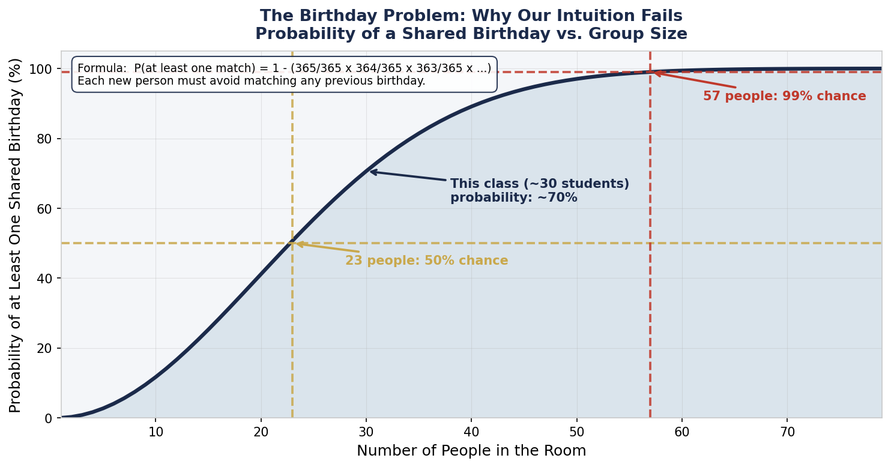
*Probability of at least one shared birthday as group size grows. The curve crosses 50% at just 23 people. With 30 people the probability is already about 70%, and with 57 it exceeds 99%.*

| People in the room | Probability of a shared birthday |
|-------------------|----------------------------------|
| 10 | 12% |
| 20 | 41% |
| 23 | 50% -- the crossover point |
| 30 | 70% |
| 40 | 89% |
| 57 | 99% |

---

### How the Calculation Works

The easiest approach: calculate the probability of *no match at all*, then subtract from 100%.

- Person 1 arrives. No match possible yet.
- Person 2 arrives. 364 out of 365 birthdays would avoid matching Person 1.
- Person 3 arrives. 363 out of 365 birthdays would avoid matching either of the first two.
- Continue for every person.

Each new person has to avoid matching all the birthdays that came before. The "safe" fraction shrinks with every new arrival. By the time you reach 23 people, the probability of no match has dropped below 50% -- meaning a match is more likely than not.

The probability grows so fast because the number of pairs grows much faster than the number of people. Adding 10 more people to a room does not add 10 more chances for a match -- it adds dozens.

---

### This Is Not Just a Puzzle

**Coincidences in general:** In a city of a million people, the number of ways any two people could be connected -- through jobs, neighborhoods, schools, mutual friends -- is staggeringly large. Running into someone you know is not surprising. The math says it should happen regularly.

**DNA databases:** As forensic DNA databases grow larger, the probability of a coincidental match between two unrelated people increases, following the same logic as the birthday problem. This matters in criminal cases where juries may assume a database match is definitive proof.

**The live demo:** If your class has more than 23 students, go around the room right now and have everyone say their birthday out loud. There is better than a 50-50 chance someone will call out a match before you finish. In a class of 30, the probability is about 70%.

**Sources:**
- Diaconis, P., & Mosteller, F. (1989). Methods for studying coincidences. *Journal of the American Statistical Association, 84*(408), 853-861.

---

## Closing: What You Now Know How to Do

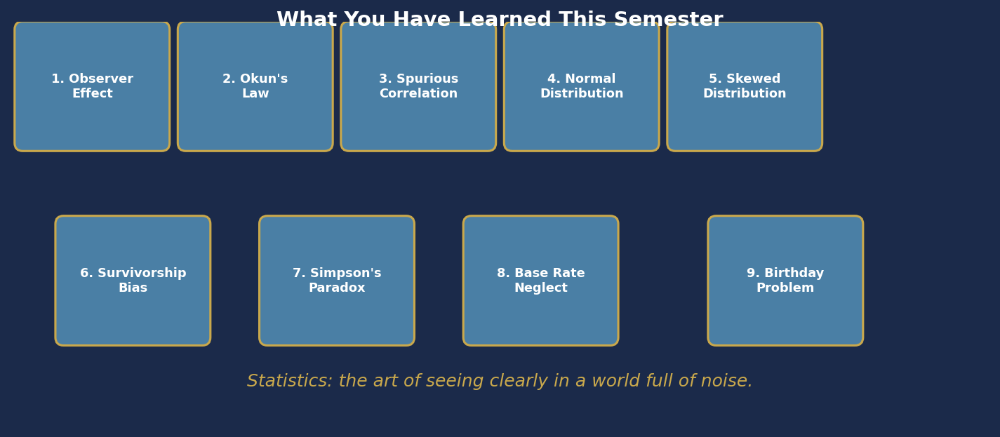

These six stories are connected by one thread: statistics is the discipline of asking the right questions about data before you trust it.

Here are the six questions you now know how to ask:

1. **Was the measurement process blind?** Could the observer's expectations have influenced the result?
2. **Is this a correlation?** What might a hidden third variable be?
3. **How strong is the relationship -- and how much scatter is there around it?**
4. **Is this a mean or a median?** What shape is the underlying distribution?
5. **Am I only seeing survivors?** What happened to the cases not in this data?
6. **How many chances were there for this to happen?** Is this coincidence as surprising as it looks?

You do not need a calculator to ask these questions. You need the vocabulary and the habit of mind you have been building all semester.

> *A statistical thinker is not someone who distrusts numbers. It is someone who knows exactly what to ask before trusting them.*

---

## Quick Reference

| Concept | Plain English | Where It Appeared |
|---------|--------------|------------------|
| Observer bias | Your expectations change what you measure | Clever Hans, AI |
| Confounding variable | A hidden third thing is causing both | Storks and babies |
| Correlation (r) | How tightly two variables move together, -1 to +1 | Okun's Law |
| Negative correlation | One goes up, the other goes down | Okun's Law |
| Right-skewed distribution | Long tail to the right; mean is higher than median | Household income |
| Median | The middle value; not moved by extremes | Household income |
| Survivorship bias | You only see what made it through the filter | WWII planes, funds |
| Coincidence probability | Far higher than intuition suggests | Birthday problem |

---

*Presentation by Pete Halbeisen*
*Charts generated with Python / matplotlib / scipy*
*Data sources cited within each section*
